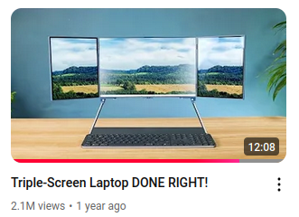

# Portable Three Panel Display
Inspired by DIYPerks':

All displays looked up at https://www.panelook.com/

There currently are no UBS-C DisplayPort 1.4/2.1 based hubs that allow plugging multiple UBS-C based displays into a single USB-C port of a labtop. USB-C to HDMI hubs exist but HDMI does not provide power to a display.

## Example single displays:
Least expensive UBS-C/HDMI display is an iPad3/4 based kit. They are available for $40 inclusive the driver board.

16" 4k display is about $120 plus $20-30 driver board.

Display case or bezel need to be manufactured.

## Example folding display arrangements

  

DIY Perks display is based on iPad 3/4 displays and central 15" gaming LCD.

### High Resolution Screen Dimensions

| Resolution | Diagonale | Width | Height | OLED | eBay / Aliexpress |
| -----------| ----------| ----- | ------ | ---- | --- |
| 2560x1600  | 8.4"      | 7.12  | 4.45   | Y | $100
| 2560x1600  | 8.9"      | 7.56  | 4.72   |   |
| 2048x1536  | 9.7       | 7.74  | 5.81   |   | $30 iPad3/4
| 2560x1600  | 10.5      | 8.92  | 5.57   | y | $80
| 3840x2160  | 13.3"     | 11.57 | 6.51   | y | $90-140
| 2880x1800  | 13.3"     | 11.57 | 6.51   |   | $100-180
| 3840x2160  | 14"       | 12.17 | 6,85   |   |
| 3840x2400  | 14"       | 11.88 | 7.43   | y | $230
| 3840x2160  | 15.6"     | 13.55 | 7.62   | y | $230
| 2560X1440  | 15.6"     | 13.59 | 7.65   |   | Gaming 165Hz laptop |
| 3840x2400  | 16"       | 13.56 | 8.48   | y | $120-160
| 3840X2400  | 17"       | 14.42 | 9.01   |   |

### 8.3" Side Panel
8.3" 2266x1488 326dpi  6.94x4.56

### 8.4" Side Panel
| | | |  
| --- | --- | --- |  
| 1600x2560 | | 7.12x4.45

| Manufacturer | Part # | Brightness | Contrast | Connector | Type | Framerate |
| ------------ | ------ | ---------- | -------- | --------- | ---- | --------- |
| Sharp   | TL084BDXP02-05 | 430 | 1500:1  | MIPI | LCM | 60Hz  
| Samsung | AMS840CS03     | 300 | 10000:1 | MIPI | OLED | 60Hz  
| Samsung | AMS840CS04     |  |  |  | OLED |   

### 8.9" Side Panel
2560x1600 7.5x4.7

| Manufacturer | Part # | Brightness | Contrast | Connector | Type | Framerate |
| ------------ | ------ | ---------- | -------- | --------- | ---- | --------- |
| JDI | TFTMD089030 | 500 | 1200:1 | MIPI | LCM | 60Hz

| | | |  
| --- | --- | --- |  
| 1920x1200 | | |

| Manufacturer | Part # | Brightness | Contrast | Connector | Type | Framerate |
| ------------ | ------ | ---------- | -------- | --------- | ---- | --------- |
| Sam | LTL089CL02-002 | 450 | 900:1 | MIPI | LCM | 60Hz

### 9.7" Side Panel
**LEAST EXPENSIVE**
| | | |  
| --- | --- | --- |  
| 2048x1536 | | 7.76"x5.82"

| Manufacturer | Part # | Brightness | Contrast | Connector | Type | Framerate | Comment |
| ------------ | ------ | ---------- | -------- | --------- | ---- | --------- | ------- |
| LG      | LP097QX1-SPA1 | 440 |  800:1 |     | LCM  | 60Hz | ipad 3,4 |
| LG      | LP097QX2      | 440 |  800:1 |     | LCM  | 60Hz |          |
| Samsung | LTL097QL01    | 420 | 1000:1 | eDP | WLED | 60Hz | iPad 3,4 |

On AliExpress driver board with display is $43. Search for LP097QX1-SPA1 

### 10.5" Side Panel

2560*1600, 2k

| Manufacturer | Part # | Brightness | Contrast | Connector | Type | Framerate |
| ------------ | ------ | ---------- | -------- | --------- | ---- | --------- |
| Samsung | AMSA05BV09| 300 | 54,000:1 | MIPI | OLED | 60Hz |

### 12.9" Side Panel

| | | |  
| --- | --- | --- |  
| 2732x2048 | |  | 

| Manufacturer | Part # | Brightness | Contrast | Connector | Type | Framerate | Comment |
| ------------ | ------ | ---------- | -------- | --------- | ---- | --------- | ------- |
| LG           |        |  | |  |  |  | ipadPro 12.9

### 13.3" Main Display

| | | |  
| --- | --- | --- |  
| 3840x2160 | 4k | 11.57x6.51 | 

| Manufacturer | Part # | Brightness | Contrast | Connector | Type | Framerate |
| ------------ | ------ | ---------- | -------- | --------- | ---- | --------- |
| LG      | LP133UD1-SPA1 | 340 | 1400:1  | eDP | LCM    | 60Hz |
| Samsung | ATNA33TP10    | 400 | 10000:1 | eDP | AMOLED | 60Hz | $140
| Sharp   | LQ133D1JX31   | 400 | 1500:1  | eDP | LCM    | 60Hz |

- ATNA33TP10  $96-$180 (non touch) 2023
- ATNA33TP11 \$90 (aliexpress) -\$ 130(ebay) (non touch) 2022

| | | |  
| --- | --- | --- |  
| 2880x1800 | 3k | 11.25" x 7.04"

- ATNA33AA05-0  $168
- ATNA33AA01-002 $100
- ATNA33AA06 $120
- ATNA33AA02-0 $160-188
- ATNA33AA03-0 $120-180

### 14" Main Display

| | | |  
| --- | --- | --- | 
| 3840x2160 | 4k | 12.2" x 6.86"

| Manufacturer | Part # | Brightness | Contrast | Connector | Type | Framerate |
| ------------ | ------ | ---------- | -------- | --------- | ---- | --------- |
| LG | LP140UD2-SPB1 | 400 | ? | eDP | LCM | ?

| | | |  
| --- | --- | --- | 
| 3840x2400 | 4k | 11.9" x 7.4"

| Manufacturer | Part # | Brightness | Contrast | Connector | Type | Framerate |
| ------------ | ------ | ---------- | -------- | --------- | ---- | --------- |
| Samsung | ATNA40YN04-0 | 400 | 100,000:1 | edP | OLED | 60HZ
| Samsung | ATNA40YN04-1 | | | | |

### 15.6" Main Display
| | | |  
| --- | --- | --- |  
| 3840x2160 | 4k | 13.55" x 7.62"

| Manufacturer | Part # | Brightness   | Contrast | Connector | Type | Framerate |
| ------------ | ------ | ----------   | -------- | --------- | ---- | --------- |
| BOE     | NE156QUM-NZ3 | 400         | 1,200:1   | eDP      | LCM  | 120Hz
| Samsung | ATNA56WR06-0 | 440         | 100,000:1 | eDP      | OLED | 60Hz

- ATNA56WR06-0 13.55 x 7.62
- ATNA56WR18-0
- ATNA56WR01-002
- ATNA56WR04-0
- ATNA56WR16-0
- ATNA56WR11

### 16" Main Display

| | | |  
| --- | --- | --- |  
| 3840x2400 | 4k | 13.56 x 8.48

| Manufacturer | Part # | Brightness | Contrast | Connector | Type | Framerate |
| ------------ | ------ | ---------- | -------- | --------- | ---- | --------- |
| Sam | ATNA60YV02-0| 440 | 100,000:1 | eDP1.4b | OLED | 60Hz

- ATNA60YV01-0 $150
- ATNA60YV02-0 $120 
- ATNA60YV06-0 $185
- ATNA60YV07 $187
- ATNA60YV08 $200
- ATNA60YV09 $330

## USB-C MST dock

### Three Displays through USB-C
- Startec tripple 4k USB-C to HDMI https://a.co/d/8HaL61R

Needs UBS-C DisplayPort 1.4 with compression om computer for triple 4k 60Hz display

### Two Displays through UBS-C

### DIY Hub

- TUSB1046-DCI for each display port
- TI HD3SS460  Display Port Splitter MST
DisplayPort MST HUB: 
- Synaptic VMM9430
- Synaptic DL-7400
- TPS65987D  USB PD controller
- USB Hub IC (microchip or renesas)

## Controller Boards

### iPad3/4 Controller Board

1) Adafruit Qualia Bare Driver iPad DisplayPort LP097QX1 driver
2) iPad 3/4 LP097QX1-SPA1 LTL097QL01 9.7 Inch DIY IPS 2048*1536 LCD Display Screen Monitor Control Driver Board $13, Mini-HDMI, UBS-C
3) Mini HDMI USB Type-C LCD Control Driver Board for iPad 3/4 LP097QX1/LTN097QL01, same as above from eBay $30
4) IPAD3 / 4 2K 2048X1536 LP097QX1 A1416 A1430 A1403 A1458 A1459 A1460 LCD Screen Mini-HDMI Control Driver Board Kit , mini-HDMI $ 10
5) IPAD5 9.7 inch eDP LCD screen 2K DIY Driver Board Kit MINI HDMI VGA type-C USB LP097QX2 air A1474 A1475 A1822 A1823 A1893, $26.40, USB-C, Mini-HDMI

### eDP Controller Board

1) Aliexpress $16, 40PIN Micro HDMI to EDP driver board EDP Signal LCD screen driver Adapter Portable LCD Display Projection 2K 4K 60hz 120Hz 144hz
    - 1920*1080/120HZ,
    - 1920*1200/144HZ, 
    - 2560*1440/120HZ,
    - 2560*1600/120HZ, 
    - 3200*1800/48HZ, 
    - 3840*2160/60HZ, 
    - 3840*2400/60HZ 

compatible with 16:9/16:10 

2) $19 edp driver board 4k 8K 120HZ DP to eDP for Portable LCD display edp 30P 40P
3) $30 40P 0.5mm edp lcd driver board HDMI input Type-c PD power 5-20V support 4K 60HZ 3K 2K 1080P

## Power

## Enclosure
Hinges: https://a.co/d/isZmx7a

## Resolutions

STD
- UXGA 1600x1200
- QXGA 2048x1536 or 2048x1600

Wide
- WUXGA 1920x1080 or 1920x1200 1.6:1

Large Wide
- QWXGA 2048x1152
- 3.6k 2560X1440 16:9
- WQXGA 2560x1600
- WQSXGA 3200x2048
- WQUXGa 3840X2400 3840X2160 4K 
- 8K 7680x4320 8K

Sizes
- 13-14 Light
- 15-16 Standard
- 17-18 Large

